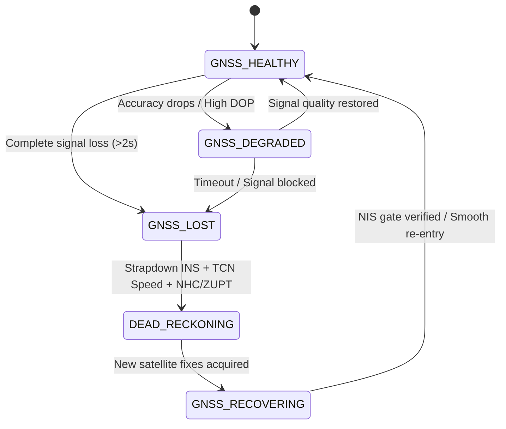

# Percorsa
### AI-Assisted Resilient Navigation for GNSS-Denied Environments

Percorsa is an Android-based navigation system that combines smartphone IMU sensing, ML-based motion estimation, inertial navigation, GNSS fusion, and map/vehicle constraints to maintain continuous navigation during GNSS outages. Designed for resilient dead reckoning in challenging operational conditions, the system bridges satellite dropouts without abrupt positioning loss.

[](android/)
[](android/app/src/main/java/com/percorsa/sensorlogger/)
[](requirements.txt)
[](src/ml/)
[](android/app/build.gradle.kts)
[](src/maps/)
[](tests/)

---

## 1. Problem Statement

Satellite navigation (GNSS) frequently degrades or vanishes entirely in tunnels, multi-level underpasses, dense urban canyons, forested canopies, parking garages, and environments subject to radio-frequency interference or spoofing. 

Standard consumer smartphone navigation applications depend entirely on continuous satellite ephemeris fixes. When signals drop, position updates freeze, jump erratically, or rely on naive unconstrained double-integration of noisy MEMS accelerometer readings—leading to rapid positional divergence (often hundreds of meters within seconds). Percorsa provides continuous, physically bounded navigation state estimation when GNSS becomes degraded or unavailable.

---

## 2. What Percorsa Does

Percorsa implements an integrated edge-to-cloud navigation pipeline designed for automotive dynamics:

$$\text{Smartphone / External IMU} \longrightarrow \text{Sensor Canonicalization} \longrightarrow \text{TCN Forward Speed Estimation} \longrightarrow \text{Strapdown INS Propagation} \longrightarrow \text{15-State ESKF Fusion} \longrightarrow \text{Map \& Vehicle Constraints} \longrightarrow \text{Navigation Controller} \longrightarrow \text{Android Navigation UI}$$

When GNSS signals are healthy, the estimator uses high-confidence satellite fixes to continuously calibrate accelerometer and gyroscope sensor biases alongside device-to-vehicle orientation. When GNSS outages occur, Percorsa smoothly transitions to dead reckoning—integrating strapdown inertial kinematics with Temporal Convolutional Network (TCN) forward-velocity updates, Non-Holonomic Constraints (NHC), Zero Velocity Updates (ZUPT), and route-network geometry to suppress drift until satellite recovery.

---

## 3. Key Capabilities

| Capability | Implementation | Architectural Role |
|---|---|---|
| **Vehicle-Frame Calibration** | Gravity-anchored + yaw alignment (`FrameTransforms.kt`) | Maps arbitrary phone mounting orientations into vehicle forward/lateral/up axes |
| **ML Speed Estimation** | Causal Dilated 1D TCN (`src/ml/tcn.py`, `TcnSpeedPredictor.kt`) | Predicts forward velocity from 6-axis IMU vibration dynamics to replace naive double-integration |
| **Inertial Navigation** | Strapdown INS mechanization (`src/navigation/ins.py`, `EskfPropagator.kt`) | Continuous nominal state integration for position, velocity, and Hamilton quaternion attitude |
| **Sensor Fusion** | 15-state Error-State Kalman Filter (`src/navigation/eskf.py`, `PercorsaEskfProvider.kt`) | Fuses kinematics, TCN velocity, GNSS observations, and bias error states via Joseph-form covariance updates |
| **GNSS Quality Handling** | Adaptive quality monitor + NIS gating (`GnssQualityMonitor.kt`, `EskfGnssUpdater.kt`) | Classifies GNSS health (Good/Fair/Poor/Lost), gates multipath innovations, and manages re-entry |
| **Map Matching** | Route geometry projection & track tracking (`RouteGeometry.kt`, `src/navigation/route.py`) | Projects navigation estimates onto active OSRM route segments and computes cross-track / heading errors |
| **Vehicle Motion Constraints**| Non-Holonomic Constraints (NHC) + ZUPT (`EskfConstraintUpdates.kt`, `src/navigation/constraints.py`) | Enforces near-zero lateral/vertical velocity ($v_y \approx 0, v_z \approx 0$) and zero-velocity clamp during halts |
| **On-Device Edge Inference** | ONNX Runtime Mobile (`onnxruntime-android:1.22.0`) | Executes optimized `tcn.onnx` directly on Android CPU with low power overhead |
| **Developer Telemetry** | 10 structured diagnostic cards (`DebugActivity.kt`) | Real-time visibility into filter states, covariance traces, NIS metrics, sensor streams, and CSV logging |
| **Sensor Abstraction** | Canonical IMU interface (`ImuMeasurementFrame`, `CanonicalImuSample.kt`) | Decouples downstream estimators from Android `SensorEvent` for external/higher-rate IMU integration |

---

## 4. System Architecture

```mermaid
flowchart TD
    subgraph Sensing["Sensing Layer"]
        A[Android 6-Axis IMU] --> B[SensorEngine]
        ExtIMU[External IMU Stream] -.->|Canonical Frame| B
        GNSS[Android GNSS Subsystem] --> C[GnssQualityMonitor]
    end

    subgraph Preprocessing["Preprocessing & Normalization"]
        B --> D[ImuPreprocessor]
        D -->|10 Hz Resampling & Frame Rotation| E[Canonical IMU Stream]
        E --> F[TcnInputBuffer]
    end

    subgraph Estimation["Estimation & AI Fusion Core"]
        F -->|50-Sample Rolling Window [1,6,50]| G[TcnSpeedPredictor / ONNX Runtime]
        G --> H[TcnSpeedFilter / Rate Limiter]
        
        E -->|IMU Kinematics dt=100ms| I[Strapdown INS Propagator]
        I -->|Nominal State Propagation| J[15-State ESKF Core]
        H -->|ML Forward Speed Measurement Update| J
        C -->|Trusted Fixes / Innovation Gating| J
        
        K[Vehicle & Map Constraints] -->|NHC: vy=0, vz=0 | J
        K -->|ZUPT / Zero Angular Rate| J
    end

    subgraph Controller["Navigation & Routing Engine"]
        J -->|Fused State: Lat, Lon, Speed, Heading, Covariance| L[NavigationController]
        M[OSRM Routing / Nominatim Search] --> L
        N[TurnDetector & OffRouteDetector] --> L
    end

    subgraph UI["User Interfaces"]
        L --> O[Android Navigation UI / Map Activity]
        L --> P[Developer Telemetry Dashboard]
        L -.->|Optional REST Telemetry| Q[FastAPI Cloud Ingestion Server]
    end
```

---

## 5. Core Technical Details

### Sensor Pipeline
- **Raw Callback Ingestion**: Ingests hardware accelerometer, gyroscope, gravity, and rotation vector callbacks asynchronously via Android `SensorEventListener` (`SensorEngine.kt`).
- **Timestamp & Monotonicity Management**: Validates monotonic nanosecond timestamps (`SystemClock.elapsedRealtimeNanos()`), detects dropped samples or stalls, and guards against duplicate sensor frames.
- **Resampling & Canonicalization**: Resamples raw measurements to a deterministic **10 Hz** sample grid ($dt = 0.1\text{ s}$).
- **Vehicle-Frame Transformation**: Leverages Android rotation vectors and gravity vectors to resolve the rotation matrix $R_{p}^v$ mapping device-body coordinates to the vehicle frame ($X\text{-forward}, Y\text{-lateral}, Z\text{-up}$).
- **Outlier Filtering**: Clamps anomalous acceleration spikes and manages initial sensor stabilization.

### ML Speed Estimation Contract
- **Input Channels (6)**: `[accel_forward, accel_lateral, accel_up, gyro_forward, gyro_lateral, gyro_up]`
- **Sample Rate**: Deterministic **10 Hz**
- **Temporal Window**: **5.0 seconds** (50 historical samples)
- **Input Tensor Signature**: `[1, 6, 50]` (`Float32`)
- **Output Tensor Signature**: `[1]` (`Float32`, forward speed `speed_mps` in $m/s$)
- **Architecture**: 4 residual blocks with dilated causal 1D convolutions (kernel size 3, dilations `[1, 2, 4, 8]`, 128 hidden channels per block, receptive field of 31 samples / 3.1 seconds, 348,417 parameters).
- **Inference Runtime**: Executed locally on-device via **ONNX Runtime Mobile** (`tcn.onnx`, **~1.35 MB**).

### 15-State Error-State Kalman Filter (ESKF)
Percorsa implements an error-state Kalman filter with a 15-dimensional state error vector $\delta\mathbf{x}$:

$$\delta\mathbf{x} = \begin{bmatrix} \delta\mathbf{p}_{3\times 1} & \delta\mathbf{v}_{3\times 1} & \delta\boldsymbol{\theta}_{3\times 1} & \delta\mathbf{b}_{a, 3\times 1} & \delta\mathbf{b}_{g, 3\times 1} \end{bmatrix}^T$$

- **Nominal State**: 3D position (ENU / WGS-84 reference), 3D velocity (world ENU), attitude quaternion $\mathbf{q}$ (Hamilton $[w, x, y, z]$ mapping phone frame to ENU), 3D accelerometer bias $\mathbf{b}_a$ (phone frame), and 3D gyroscope bias $\mathbf{b}_g$ (phone frame).
- **Kinematic Propagation**: Continuous nominal integration via strapdown inertial mechanization with gravity compensation; error covariance propagation $\mathbf{P}_{k|k-1} = \mathbf{F}_d \mathbf{P}_{k-1} \mathbf{F}_d^T + \mathbf{Q}_d$.
- **Measurement Updates**: Joseph-form stabilized covariance updates $\mathbf{P} = (\mathbf{I} - \mathbf{K}\mathbf{H})\mathbf{P}(\mathbf{I} - \mathbf{K}\mathbf{H})^T + \mathbf{K}\mathbf{R}\mathbf{K}^T$.
- **Innovation & NIS Gating**: Normalized Innovation Squared ($\text{NIS} = \mathbf{r}^T \mathbf{S}^{-1} \mathbf{r}$) gating using Chi-Square distribution thresholds prevents spurious updates from corrupting state estimates.
- **Error Injection & Reset**: Injects estimated error vector into the nominal state ($\mathbf{p} \leftarrow \mathbf{p} + \delta\mathbf{p}$, $\mathbf{v} \leftarrow \mathbf{v} + \delta\mathbf{v}$, $\mathbf{q} \leftarrow \mathbf{q} \otimes \delta\mathbf{q}$) and resets the error state to zero.

### GNSS Handling & Recovery Lifecycle
- **Trusted GNSS**: Fixes meeting accuracy ($\le 15\text{ m}$) and quality thresholds provide full position and velocity innovation corrections to the ESKF.
- **Degraded GNSS**: Degraded observations (high dilution of precision, multipath jumps) undergo measurement noise inflation or rejection via NIS gating.
- **Outage Detection**: Transition to dead reckoning is triggered immediately when GNSS updates cease or fail quality thresholds.
- **GNSS Recovery**: When satellite fixes return, the filter checks innovation gates; if position has drifted during long outages, position/velocity covariance is adaptively inflated to smoothly re-converge without abrupt trajectory tearing or filter reboots.

### Map & Vehicle Constraints
- **Non-Holonomic Constraints (NHC)**: Enforces physical automotive kinematics assuming zero wheel slip under normal driving: lateral velocity $v_y \approx 0$ and vertical velocity $v_z \approx 0$ in the vehicle frame.
- **Zero Velocity Updates (ZUPT)**: Automatically detects vehicle halts via acceleration variance and gyro thresholds, applying a direct zero-velocity pseudo-measurement update that locks position drift and estimates gyroscope bias.
- **Route Geometry Projection**: Projects filtered coordinates against active polyline segments from OSRM to track route progress, cross-track error, and heading deviation.
- **Turn & Off-Route Detection**: Monitors vehicle yaw rate ($\ge 12^\circ/\text{s}$) to detect maneuvers and evaluates sustained cross-track displacement ($> 30\text{ m}$) to trigger automatic route recalculation.

---

## 6. AI-Assisted GNSS/INS Fusion

Percorsa uses an **AI-assisted GNSS/INS fusion** architecture. The machine learning model does not act as an unconstrained end-to-end black box position predictor; instead, it is integrated as a dedicated virtual sensor within the Bayesian state estimator.

```text
  ┌────────────────────────────────┐
  │ 6-Axis IMU Canonical Stream    │
  └───────┬────────────────┬───────┘
          │                │
          ▼                ▼
   ┌──────────────┐  ┌────────────────────────────────────────────────────────┐
   │ 1D CNN / TCN │  │ High-Rate Strapdown Inertial Kinematics                │
   │ Speed Model  │  │ (Orientation Tracking, Gravity Compensation)           │
   └──────┬───────┘  └────────────────────────────┬───────────────────────────┘
          │ Predicted Speed v_x                   │
          ▼                                       ▼
   ┌──────────────────────────────────────────────────────────────────────────┐
   │                     15-State Error-State Kalman Filter                   │
   │                                                                          │
   │   • Prediction: Nominal Kinematics + Covariance Propagation              │
   │   • Updates:    GNSS (when trusted)                                      │
   │                 TCN Speed (virtual odometer measurement)                 │
   │                 NHC (v_lateral = 0, v_up = 0)                            │
   │                 ZUPT (stationary zero-velocity clamp)                    │
   └──────────────────────────────────────┬───────────────────────────────────┘
                                          │
                                          ▼
                               ┌──────────────────────┐
                               │ Fused Vehicle State  │
                               └──────────────────────┘
```

The TCN predicts scalar forward speed $v_x$, which is formulated as an explicit measurement update:

$$h_{\text{TCN}}(\mathbf{x}) = \mathbf{e}_1^T \mathbf{R}_v^p \mathbf{R}(q)^T \mathbf{v}_{\text{world}}$$

This allows the filter to observe vehicle forward velocity during satellite blackouts without suffering from runaway accelerometer double-integration errors.

---

## 7. GNSS Outage Behavior

Percorsa manages outage transitions through a deterministic state machine:



Throughout the outage cycle, the estimator continues active propagation and error correction rather than restarting the filter, preserving accumulated attitude and sensor bias states.

---

## 8. Edge & External IMU Architecture

The navigation engine is decoupled from Android-specific `SensorEvent` classes via the `ImuMeasurementFrame` and `CanonicalImuSample` interfaces. 

```kotlin
interface ImuMeasurementFrame {
    val timestampNs: Long
    val accelX: Float
    val accelY: Float
    val accelZ: Float
    val gyroX: Float
    val gyroY: Float
    val gyroZ: Float
    val vehicleFrameCalibrated: Boolean
}
```

This clean abstraction separates the state estimator from the physical hardware producer, making Percorsa **architecture-ready for integration with higher-rate external IMUs** (e.g., dedicated automotive MEMS or Fiber Optic Gyroscopes over USB/Bluetooth serial) without modifying the downstream ESKF or ML pipelines.

---

## 9. Android Application

The Percorsa mobile application is a native Android application engineered for real-time edge navigation:

- **Turn-by-Turn Navigation UI**: Interactive map view rendering OpenStreetMap tiles, displaying real-time vehicle positioning, route polylines, navigation turn cues, maneuver arrows, current speed, and heading.
- **Trip Status & Health Indicator**: Real-time pill indicators displaying GNSS health (`Good`, `Fair`, `Poor`, `Lost`, `Dead Reckoning`) and navigation mode.
- **Route Search & Calculation**: Integrated search using Nominatim geocoding and OSRM routing services.
- **Background Sensor Logging**: Continuous logging of 6-axis raw IMU, canonical samples, GNSS fixes, and filter diagnostics to timestamped CSV files.
- **Pre-Built Packages**: Ready-to-install debug binaries are available in the repository (`Percorsa-Navigation-Final.apk`, `Percorsa-Navigation-Integration.apk`).

---

## 10. Developer Mode & Diagnostics

Developer Mode provides full engineering visibility into internal estimator states without cluttering the driver-facing navigation display.

Access Developer Mode in the app via the debug action in the top toolbar to view 10 dedicated telemetry cards:
1. **Pipeline Architecture & Health**: Real-time operational status of the sensor engine, TCN predictor, and ESKF estimator.
2. **Navigation State**: Current navigation mode, active dead reckoning provider, and GNSS blend factor.
3. **AI Speed Estimation**: Raw TCN inference output, filtered speed, rate limiting counters, and outlier rejections.
4. **15-State ESKF Telemetry**: Full nominal state vector (position ENU, velocity ENU, quaternion norm, biases) and $15\times 15$ covariance trace.
5. **Measurement Innovations & NIS**: Acceptance flags, NIS values, and rejection reasons for GNSS, TCN, NHC, and ZUPT updates.
6. **Vehicle Frame Alignment**: Dynamic pitch, roll, and azimuth angles alongside phone-to-vehicle transformation validity.
7. **Map-Matching Diagnostics**: Active route segment ID, distance along route, cross-track error, heading error, and turn detection status.
8. **GNSS Metrics**: Raw satellite count, HDOP, horizontal accuracy, fix timestamp, and 1D adaptive Kalman filter state.
9. **Raw Sensor Streams**: Real-time 3-axis accelerometer, gyroscope, magnetometer, and gravity readings.
10. **Data Logging & Export**: On-device CSV recording controls and Android share sheet export for field trial analysis.

---

## 11. ML Training & Provenance

### Training Pipeline
The ML pipeline provides end-to-end tooling for model training and deployment:
```powershell
# 1. Train the TCN model
python -m src.ml.train

# 2. Evaluate model across disjoint splits
python -m src.ml.evaluate

# 3. Export PyTorch checkpoint to ONNX format
python -m src.ml.export_onnx

# 4. Verify numerical parity between PyTorch and ONNX runtimes
python -m src.ml.verify_onnx

# 5. Synchronize exported ONNX model and normalization metadata to Android assets
python scripts/deploy_android_tcn.py
```

### Dataset Provenance & Limitations
The preliminary model development was conducted using the public **IO-VNBD** (Input-Output Vehicle Navigation Benchmark Dataset) corpus. 

> [!NOTE]
> **Dataset Provenance Audit Notice**  
> IO-VNBD was used for preliminary model development and evaluation. During provenance analysis, the distributed dataset was found to lack sufficient synchronization/calibration metadata for authoritative reconstruction of the authors' exact alignment pipeline. Therefore, the current corpus is treated as a preliminary experimental benchmark rather than authoritative ground truth for production claims. Comprehensive dataset audits and source reconstruction investigations are documented in `artifacts/evaluation/`.

> [!WARNING]
> **Historical Benchmark Clarification**  
> Earlier project summaries referenced a benchmark reporting **1.64 m max drift (0.32%)**, **0.64 m RMSE**, and **99.6% error reduction** over a 45 s outage. Forensic auditing confirms this historical deliverable was generated by a legacy simulation script (`scripts/generate_benchmark_deliverable.py`) that evaluated a 2D Planar EKF over a single mathematically synthesized trajectory with ground-truth velocity directly injected. **This was a synthetic simulation and is NOT an empirical result from the current TCN + 15-state ESKF on the IO-VNBD corpus.**

---

## 12. Verification & Validation Status

| Subsystem | Verification Scope | Status |
|---|---|---|
| **Python Test Suite** | 139 automated tests covering preprocessing, ML, ESKF, kinematics, constraints, maps, and API endpoints | **Passed (139/139 passing)** |
| **Android Unit Tests** | 21 test suites covering `PercorsaEskfProvider`, `EskfPropagator`, `EskfGnssUpdater`, `EskfTcnUpdater`, `EskfConstraintUpdates`, `RouteGeometry`, `TcnInputBuffer`, `SensorEngine` | **Passed (Debug & Release)** |
| **Asset Integrity** | Automated Gradle verification task (`verifyTcnAssets`) ensuring `tcn.onnx` and `normalization.json` integrity | **Passed** |
| **PyTorch / ONNX Parity** | Max absolute difference between PyTorch and exported ONNX predictions on identical inputs | **Verified ($< 5.72 \times 10^{-6}$, tolerance $10^{-4}$)** |
| **Android Build** | Clean compilation of debug and release APK packages targeting Android SDK 34 | **Verified** |
| **Physical Hardware Benchmarks** | In-vehicle road trials across extensive multi-day drive cycles with survey-grade RTK reference | **Roadmap / Future Work** |

---

## 13. System Performance & Specifications

| Parameter | Specification / Status | Notes |
|---|---|---|
| **IMU Sampling Rate** | 10 Hz (resampled) | Canonical internal processing rate |
| **TCN Input Shape** | `[1, 6, 50]` | 6 channels, 50 samples (5.0s window) |
| **Current ONNX Model Size** | ~1.35 MB (1,417,301 bytes) | Deployed `tcn.onnx` graph (348,417 Float32 parameters) |
| **TCN CPU Inference Latency** | 3.19 ms mean | Measured across 300 runs on CPU (`artifacts/latency.json`), P50: 3.29 ms, P95: 4.08 ms |
| **ESKF Update Frequency** | Real-time at 10 Hz | Sub-millisecond state propagation on Android mobile CPU |
| **External Sensor Support** | Architecture-ready | Implemented via canonical `ImuMeasurementFrame` contract |
| **<10% Outage Drift Target** | SIH Evaluation Target | Problem statement objective; evaluated in field drive campaigns |

---

## 14. Repository Structure

```text
SIH_Axiom-Crew/
├── android/                          # Native Android navigation application (Kotlin)
│   ├── app/
│   │   ├── src/main/assets/          # Deployed ONNX model (tcn.onnx) & normalization.json
│   │   ├── src/main/java/            # SensorEngine, ESKF, TCN Predictor, Controllers, Activities
│   │   └── src/test/java/            # 21 Android unit test suites
│   ├── build.gradle.kts              # Top-level Gradle configuration
│   └── gradlew.bat                   # Gradle build wrapper
├── artifacts/                        # Exported models, parity checks, evaluation audits, and APKs
│   ├── evaluation/                   # IO-VNBD provenance reports & alignment audits
│   ├── model_info.json               # Trained model metadata & parameter counts
│   ├── normalization.json            # Feature mean & standard deviation vectors
│   ├── onnx_parity.json              # Numerical verification results
│   ├── speed_metrics.json            # Model evaluation metrics
│   ├── tcn.onnx                      # Production ONNX model artifact (~1.35 MB)
│   └── tcn_best.pt                   # PyTorch checkpoint artifact (~1.34 MB)
├── configs/                          # Experiment configs and split definitions
├── data/                             # Dataset schemas, split manifests, and raw/processed trip data
├── docs/                             # Architecture records, contracts, and schema documentation
├── models/                           # Model checkpoints and documentation
├── scripts/                          # CLI utilities for data ingestion, evaluation, API, and replays
│   ├── benchmark.py                  # Model latency profiling script
│   ├── deploy_android_tcn.py         # Deployment sync script for Android assets
│   ├── run_api.py                    # FastAPI server entry point
│   ├── run_dashboard.py              # Streamlit dashboard entry point
│   └── run_replay.py                 # Outage replay simulation tool
├── src/                              # Core Python scientific and navigation library
│   ├── api/                          # FastAPI sensor ingestion endpoints
│   ├── constraints/                  # Physical vehicle constraints (NHC, ZUPT, stop detection)
│   ├── data/                         # Data loaders, schemas, and dataset adapters
│   ├── evaluation/                   # Accuracy metrics, baselines, and ground-truth audit tools
│   ├── maps/                         # OSM road graph parsing and map-matching algorithms
│   ├── ml/                           # TCN model, PyTorch dataset, training engine, ONNX exporter
│   ├── navigation/                   # 15-state ESKF, strapdown INS, GNSS/TCN updates, route tracking
│   └── preprocessing/                # Sensor filtering, timestamp sanitization, and resampling
├── tests/                            # Automated PyTest suite (139 tests)
├── requirements.txt                  # Python package dependencies
└── README.md                         # Project documentation
```

---

## 15. Build and Installation

### Prerequisites
- **Android Development**: Android Studio Jellyfish or newer, JDK 17, Android SDK Platform 34.
- **Python Environment**: Python 3.10 or higher.

### Android Application Build
```powershell
# Navigate to the android directory
cd android

# Run all unit tests
.\gradlew.bat test

# Build debug APK
.\gradlew.bat assembleDebug
```
The compiled APK will be generated at `android/app/build/outputs/apk/debug/app-debug.apk`.

### Python Environment & Test Execution
```powershell
# Create and activate virtual environment
python -m venv .venv
.venv\Scripts\activate

# Install dependencies
pip install -r requirements.txt

# Run the complete test suite
python -m pytest tests/ -q
```

---

## 16. Demonstration Workflow

1. **Launch Percorsa**: Open the Percorsa application on an Android device or emulator.
2. **Sensor & GPS Initialization**: Allow location and sensor permissions; observe real-time satellite acquisition on the status indicator.
3. **Initiate Route Navigation**: Enter a destination via the search bar and select **Start Navigation** to load OSRM route geometry.
4. **Observe GNSS-Aided Fusion**: In open sky conditions, view real-time state fusion with high-confidence GNSS corrections.
5. **Simulate / Enter GNSS Outage**: Enter a tunnel or disable device location services.
6. **Observe Dead Reckoning**: Watch the status pill transition to `Dead Reckoning` as the 15-state ESKF continues trajectory propagation using strapdown INS and TCN forward-speed updates.
7. **Inspect Developer Telemetry**: Open Developer Mode to monitor live ESKF covariance trace, TCN speed predictions, NIS innovation acceptance, and vehicle frame alignment.
8. **Observe GNSS Recovery**: Re-enable satellite signals and verify smooth, non-divergent re-convergence of the navigation state.

---

## 17. Current Limitations & Scope

- **Preliminary ML Training Corpus**: The TCN speed model was trained on the IO-VNBD dataset. As identified during provenance auditing, public datasets often lack exact vehicle-to-phone time-synchronization ground truth, meaning current weights serve as an experimental baseline.
- **Hardware Validation Scope**: The canonical sensor layer is architecture-ready for external IMU integration, but physical testing with specialized external hardware (e.g., tactical-grade FOG/MEMS units) remains for future field campaigns.
- **Outage Drift Performance**: The target of $<10\%$ drift over distance traveled is an evaluation benchmark objective for field validation rather than an unconditional production claim across all uncalibrated devices.

---

## 18. Project Roadmap

- [ ] **Dedicated High-Precision Data Collection**: Collect custom multi-sensor driving datasets using survey-grade dual-antenna RTK GNSS as authoritative ground truth.
- [ ] **External IMU Hardware Drivers**: Develop dedicated serial/USB-OTG driver layers for direct high-rate external IMU ingestion.
- [ ] **Multi-Modal Motion Classifiers**: Implement dynamic motion mode recognition (e.g., distinguishing walking, biking, automotive) to adapt constraint models dynamically.
- [ ] **Extended Outage Benchmarking**: Conduct formal urban canyon and tunnel drive trials across varied phone mounting fixtures and vehicle suspension profiles.

---

## 19. Team & Attribution

Developed by **Axiom-Crew** for **Smart India Hackathon (SIH)**.

- **Repository**: [https://github.com/Pratik-Devang/SIH_Axiom-Crew](https://github.com/Pratik-Devang/SIH_Axiom-Crew)
- **Problem Statement**: AI/ML-assisted resilient navigation for GNSS-denied environments.
